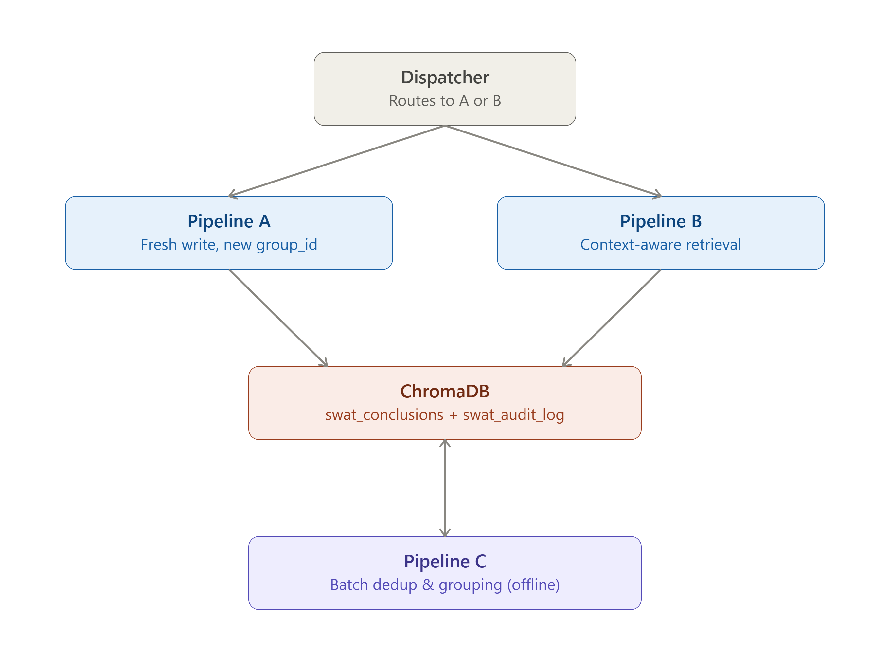

## Sovereign SWAT vNext — GemmaEdge V7 Memory Layer
 
Fully offline, sovereign memory architecture and decoupled inference pipelines for local LLM operations. No cloud dependencies, no telemetry. Built on ChromaDB + local embedder snapshot + local LLM inference, structured as a strict logical runtime.
 

 
## Status / What this is
 
This is a **blueprint, not a code drop** — it documents the architecture, design decisions, and empirical findings behind a working 3-pipeline local LLM system, but the actual pipeline source (prompts, orchestration scripts) isn't included here. What you'll find instead: the reasoning behind every major design choice, and real execution logs proving this works, not just a description of how it theoretically could.
 
If you're trying to build something similar, this demonstrates the structural foundation. If you're trying to copy it wholesale — you'll need to engineer the actual orchestration code, dynamic thresholds, and state-management yourself.
 
Tested on: AMD Ryzen 7 7700, RTX 5060 Ti (8GB VRAM), 16GB RAM, Windows 11.
Model: `gemma-4-E4B-it-Q4_K_M.gguf` + local `all-MiniLM-L6-v2` embedder for audit/clustering. This architecture is built around an 8GB VRAM floor — below that, expect OOM crashes or heavy CPU offloading.
 
---
 
## 🧠 The Sovereign SWAT Doctrine (Design Principles)
 
This pipeline is built on a strict, anti-hallucination architectural philosophy. It prevents uncontrolled context pollution by isolating historical memory from active logic engines. 
 
* **ROUTER DECIDES THE PATH:** Inference is explicitly divided into Fresh Queries (Pipeline A) and Continuation Queries (Pipeline B) based on dynamic database relevance.
* **PREVALIDATOR OWNS CONTEXT:** Only Stage 0 (PreValidator) and Stage 4 (Voice) are allowed to see historical memory from ChromaDB. The PreValidator's job is to filter noise, extract meaning, and build an airtight context package.
* **REASONING STAYS PURE:** The Structural Analyst (Stage 1) receives only the filtered operational facts. It is entirely blind to past memory, ensuring its structural mechanics breakdown is unbiased.
* **ORACLE STAYS BLIND TO CONTEXT:** The Adversarial Critic (Stage 2) attacks the immediate proposal. By keeping the Oracle blind to the broader historical context, it cannot be "softened" by past successes—it only sees immediate risk.
* **ONE IDENTITY, MULTIPLE DUTIES:** The entire system runs on a single underlying model (`gemma-4-E4B`), manipulated into radically different logical personas via strict prompt boundaries.
---
 
## 🚀 The 5-Stage Cognitive Engine
 
Unlike standard TaskBot loops, Pipelines A and B operate a rigorous **5-Stage Multi-Agent Matrix**. The system forbids immediate answers, forcing a structured debate between isolated logical personas, strictly gated by a deterministic algorithm.
 
### Pipeline A (First-Write) vs Pipeline B (Context-Aware)
* **Pipeline A (`run_test_a.py`):** The "Fresh" path. It runs the 5-stage matrix purely on the user's immediate input. It writes its conclusion to ChromaDB blindly at the end, assigning a unique `group_id`.
* **Pipeline B (`run_test_b.py`):** The "Continuation" path. It queries ChromaDB before execution. If the calibrated relevance threshold is met, it injects historical data directly into the Context-Aware PreValidator. 
### Running It: Individual Tests vs. the Dispatcher
 
`run_test_a.py`, `run_test_b.py`, and `run_test_memory.py` each run **one pipeline in isolation** — useful for testing or debugging a single stage of the system without the others interfering.
 
`run_dispatcher.py` is the actual master switch for real use: it runs a dispatcher router first, which performs a rapid similarity check against a strict upper boundary to decide, per query, whether to route into Pipeline A or Pipeline B — the split between "fresh" and "continuation" queries happens here automatically.
 
### The Execution Stages:
1. **Stage 0: PreValidator (Anchor Definition):** Distills the raw query into a rigid structural anchor. It never answers the question. It explicitly maps out `[SCOPE]`, identifies `[MISSING_FACTS]` (retrievable data), and declares `[ASSUMABLE_GAPS]` (theoretical models) to constrain the downstream agents. *(In Pipeline B, this is where Memory Context is injected and filtered)*.
2. **Stage 1: Reasoning (Structural Analyst):** Performs pure structural mechanics breakdown within the PreValidator's scope. Hard-blocked from providing solutions or profiling dynamic risk. Analyzes tradeoffs and stops. *(Blind to memory context)*.
3. **Stage 2: Oracle (Adversarial Critic):** Attacks the proposal focusing exclusively on risk, timing, and cascade failures. Operates under strict RAM FUSION tagging rules (any non-provided probability must be tagged `[ASSUMPTION]`). *(Blind to memory context)*.
4. **Stage 3: PostValidator (Algorithmic Gate):** A zero-LLM deterministic Python algorithm. Uses SentenceTransformers to calculate semantic drift and verify if the retrievable `[MISSING_FACTS]` were hallucinated or safely addressed. Outputs a hard gate: `VOICE_PERMISSION: CLEAN` or `LIMITED`.
5. **Stage 4: Voice (Chief Architect Synthesis):** Fuses the Reasoning and Oracle matrices into a cohesive directive. If the PostValidator issued a `LIMITED` status due to missing facts, Voice is strictly forbidden from providing a solution and must aggressively demand diagnostics instead.
---
 
## 🏗️ Directory Structure
 
The system operates as a strict inference governance layer. The "steering wheel" (CLI Runners) is physically separated from the "engines" (Pipelines) and the "heavy computation" (Models).
 
* **`/` (Root):** CLI Runners only (`run_test_a.py`, `run_test_b.py`, `run_test_memory.py`). These are thin switches that import and trigger the engines.
* **`run_pipelines/`:** The execution engines. Contains the core pipeline sequence logic but no CLI inputs.
* **`engine_models/`:** Heavy computation quarantine. Houses the globally shared core modules for Reasoning, Oracle, gating, and Voice.
* **`engine_pipeline_a/` & `engine_pipeline_b/`:** Pipeline-specific logic and prompts. Each pipeline houses its own tailored modules optimized for its distinct routing needs.
* **`engine_pipeline_c/`:** Memory curation logic.
* **`chroma_storage/`:** Unified database interaction layer.
---
 
## 🔌 Dynamic Module Loading (Why Not Standard Imports)
 
Pipeline A and Pipeline B each maintain their own independent copy of the same-named modules inside their respective directories — a deliberate choice, not duplication by accident. Each pipeline's prompt logic evolves independently (e.g. Pipeline B's PreValidator handles memory-context injection, which Pipeline A's does not), so they are allowed to diverge over time without one pipeline's changes silently affecting the other.
 
To prevent namespace collisions, each pipeline's core script uses a custom dynamic loader that reads the correct file by explicit relative path at the exact moment it's needed — never earlier.
 
This also enforces lazy loading: LLM weights and engine modules are not read into memory until the first real query hits the pipeline. `GLOBAL_LLM` stays dormant until that point, ensuring CLI boot times remain near-instant regardless of model size.
 
---
 
## 🧹 Explicit Memory Control (RAM Fusion & KV Cache Reset)
 
Unlike standard LLM wrapper scripts or multi-agent frameworks that rely on implicit memory (hidden conversational states that lead to gradual token bleed), the Sovereign SWAT pipeline enforces **explicit memory serialization** between every single agent step.
 
* **Intra-Stage KV Cache Annihilation:** The system uses a single LLM instance loaded lazily into RAM. However, after *every* stage, the script explicitly forces a total state wipe. This zeroes out the model's KV Cache entirely. The Oracle cannot inherit hidden conversational state from the Reasoning stage because the runtime state is explicitly cleared between inference calls.
* **Deterministic RAM Fusion (String Serialization):** Because the LLM is rendered completely amnesiac after every step, the system relies on the Python runtime as an external memory controller. The script captures the output of Stage N, holds it in local variables, and mechanically concatenates it into explicitly tagged string blocks. This pre-built string is then fed as a completely fresh input to Stage N+1. 
* **OS-Level Process Purge:** The pipeline guarantees that when the interface is closed, all global references are securely destroyed, garbage collection is forced, and the GPU VRAM is 100% flushed. No ghost processes, no memory leaks. Every run is computationally sterile.
---
 
## 🛡️ Pipeline C — Batch Memory Maintenance
**Entry:** `run_test_memory.py` → triggers background repair protocols.
 
This pipeline is the sole authority on memory quality, deduplication, and logical grouping.
 
* **Clustering:** Builds memory clusters using a proprietary, custom-weighted hybrid scoring algorithm designed for semantic strictness.
* **Sovereign Shield:** Clusters where every member already shares the same `group_id` are bypassed to conserve compute.
* **Dual-Blade Pre-Filter (Automatic Mode):**
    * **Blade 1:** Identical query text (case/whitespace-insensitive) → Instant deletion.
    * **Blade 2:** Cluster hybrid score exceeds the near-certainty boundary (indicative of a Voice duplicate) → Instant deletion.
* **LLM Curator:** Anything surviving the blades is reviewed by the Curator LLM.
    * `MERGE`: Near-duplicates are merged (one deleted, one kept).
    * `SAME_GROUP`: Entries addressing the same problem space at different logical depths are grouped via a shared `group_id`. Nothing is deleted.
* **Audit Trail:** Every automated action is immutably logged to the audit collection with the exact trigger metric.
---
 
## ⚠️ Known Limitations
 
This pipeline is optimized for **technical, architectural, and risk-bearing
questions** — the kind where a structural breakdown (Reasoning) and an
adversarial risk critique (Oracle) genuinely add value. It is not a
general-purpose chatbot, and it shows: casual, simple, or non-technical
queries still get routed through the full 5-stage matrix, which tends to
over-engineer trivial requests. Ask it something like "how do you build a
snowman" and Reasoning will earnestly analyze shear forces and load-bearing
composites — technically coherent, practically absurd for the question
asked. There is currently no complexity-based short-circuit that lets
PreValidator downshift a lightweight query to a lightweight answer; every
query gets the same five stages regardless of how much rigor it actually
needs.
 
---
 
## 💾 Storage & Persistence
 
The `chroma_storage/` package serves as the single unified export surface, handling conclusions, query similarities, group assignments, and audit logging.
 
All data lives entirely offline in isolated SQLite environments. The embedder uses a pinned local snapshot path, ensuring absolute network isolation and zero data leakage.
 
---
 
## 🧪 Proof of Execution
 
Real, unedited terminal logs from actual test runs — see **[LOGS.md](LOGS.md)**.
